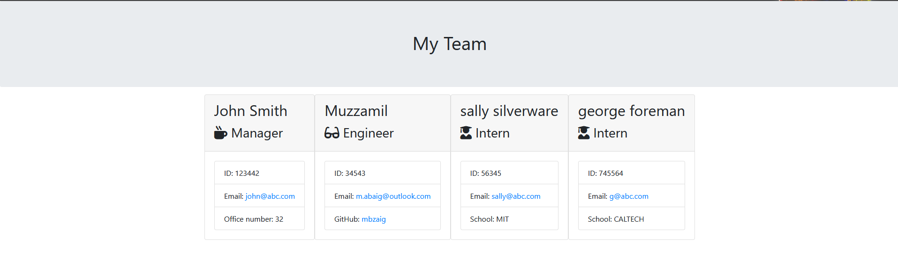

# teamHTML

The project create a CLI command to generate a simple HTML of a team at a company

## Description

- This website is created to generate a TEAM HTML page using CLI Commangs.
- While working on this website, I learnt how to use Javascript and how to work with npm jest for testing functions and node index.js


---
## Table of Contents 

- [Installation](#installation)
- [Features](#Features)
- [Usage](#usage)
- [Credits](#credits)
- [License](#license)

---
## Installation

To install the necessary dependencies, run the following commands:

```npm i inquirer@6.5.0 ```

```npm i jest --save-dev ```

---
## Features 

  


  


     

---

    
 


---
## Credits

The assigment was made possible by following the video recordings and w3schools.com
and suport from Natalie Navickas

---
## License

MIT License

Copyright (c) [2023] [Muzzamil Baig]

Permission is hereby granted, free of charge, to any person obtaining a copy
of this software and associated documentation files (the "Software"), to deal
in the Software without restriction, including without limitation the rights
to use, copy, modify, merge, publish, distribute, sublicense, and/or sell
copies of the Software, and to permit persons to whom the Software is
furnished to do so, subject to the following conditions:

The above copyright notice and this permission notice shall be included in all
copies or substantial portions of the Software.

THE SOFTWARE IS PROVIDED "AS IS", WITHOUT WARRANTY OF ANY KIND, EXPRESS OR
IMPLIED, INCLUDING BUT NOT LIMITED TO THE WARRANTIES OF MERCHANTABILITY,
FITNESS FOR A PARTICULAR PURPOSE AND NONINFRINGEMENT. IN NO EVENT SHALL THE
AUTHORS OR COPYRIGHT HOLDERS BE LIABLE FOR ANY CLAIM, DAMAGES OR OTHER
LIABILITY, WHETHER IN AN ACTION OF CONTRACT, TORT OR OTHERWISE, ARISING FROM,
OUT OF OR IN CONNECTION WITH THE SOFTWARE OR THE USE OR OTHER DEALINGS IN THE
SOFTWARE.

---


